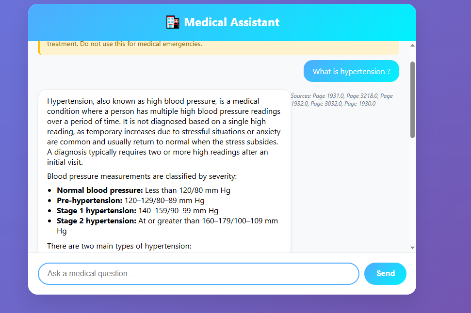

# 🏥 Medical Chatbot

A modern AI-powered medical chatbot using Retrieval-Augmented Generation (RAG) with Pinecone, LangChain, and Gemini 2.5 Flash. This project provides a web-based interface for users to ask medical questions and receive evidence-based, context-aware responses, with clear disclaimers and source references.

---

## Features
- **Conversational AI**: Chatbot answers medical questions using advanced LLMs.
- **Retrieval-Augmented Generation**: Combines LLM with vector search over PDF documents for accurate, context-rich answers.
- **Source Attribution**: Bot responses include references to the source documents/pages.
- **Modern Web UI**: Responsive, user-friendly frontend with Markdown support.

---

## Demo



---

## Quickstart

### 1. Clone the Repository
```bash
git clone https://github.com/PialGhosh2233/medical-chatbot.git
cd medical-chatbot/medical-chatbot
```

### 2. Install Python Dependencies
It is recommended to use a virtual environment.
```bash
python -m venv venv
venv\Scripts\activate  # On Windows
# Or
source venv/bin/activate  # On Mac/Linux
pip install -r requirements.txt
```

### 3. Set Environment Variables
Create a `.env` file in the `medical-chatbot` directory with the following:
```
PINECONE_API_KEY=your-pinecone-api-key
PINECONE_ENV=us-east-1
GOOGLE_API_KEY=your-google-api-key
```
- Get a [Pinecone API key](https://app.pinecone.io/)
- Get a [Google Generative AI API key](https://aistudio.google.com/apikey)

### 4. Run the Backend
```bash
uvicorn main:app --reload --host 0.0.0.0 --port 8000
```

### 5. Open the Frontend
Open `frontend.html` in your browser. The frontend connects to `http://localhost:8000` by default.

---

## API Endpoints
- `GET /health` — Health check
- `POST /chat` — Chat with the bot (`{"message": "your question"}`)
- `GET /` — API info

---

## Project Structure
```
medical-chatbot/
│   main.py            # FastAPI backend
│   frontend.html      # Web UI
│   requirements.txt   # Python dependencies
|   README.md
└── 
```

## License
[MIT](LICENSE)

---

## Acknowledgements
- [LangChain](https://github.com/langchain-ai/langchain)
- [Pinecone](https://www.pinecone.io/)
- [Google Generative AI](https://ai.google.dev/)
- [FastAPI](https://fastapi.tiangolo.com/)
- [Sentence Transformers](https://www.sbert.net/)


## Contact
For questions or support, open an issue or contact [PialGhosh2233](https://github.com/PialGhosh2233).
